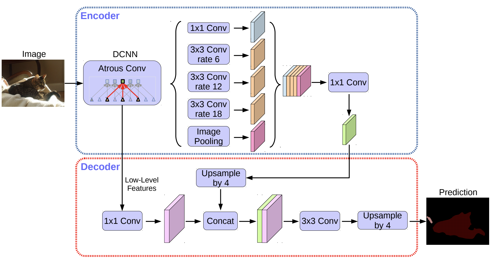
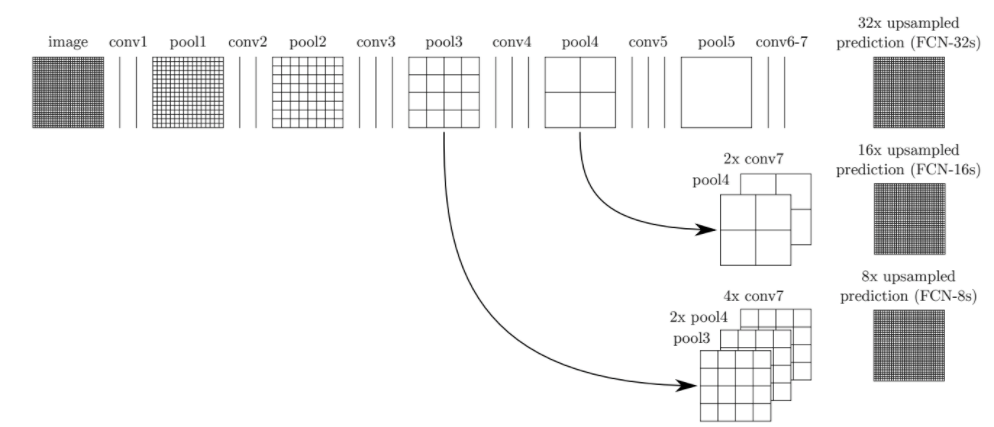

# Simple-PyTorch-implementation-of-Semantic-Segmentation-CNNs
PyTorch Implementation of Semantic Segmentation CNNs: This repository features key architectures (from scratch) like UNet, DeepLabv3+, SegNet, FCN, and PSPNet. It's crafted to provide a solid foundation for Semantic Segmentation tasks using PyTorch.

## Supported Architectures and Backbones

- **[UNet](https://arxiv.org/abs/1505.04597)**: No backbone needed.
- **[DeepLabv3+](https://arxiv.org/abs/1802.02611v3)**: Support for ResNet backbones (ResNet18, ResNet34, ResNet50, and ResNet101).
- **[PSPNet](https://arxiv.org/abs/1612.01105)**: Support for ResNet backbones (ResNet18, ResNet34, ResNet50, and ResNet101).
- **[FCN](https://arxiv.org/abs/1411.4038)**: Support for VGG backbones (VGG11, VGG13, VGG16, and VGG19).
- **[SegNet](https://arxiv.org/abs/1511.00561)**: No backbone needed.


<table>
  <tr>
    <td><br>UNet Architecture</td>
    <td><br>DeepLabv3+ Architecture</td>
  </tr>
  <tr>
    <td><br>SegNet Architecture</td>
    <td><br>FCN Architecture</td>
  </tr>
  <tr>
    <td colspan="2" align="center"><br>PSPNet Architecture</td>
  </tr>
</table>


## Optimizers and Learning Rate Schedulers

- **Optimizers**: Adam, SGD, and RMSprop.
- **Learning Rate Schedulers**: StepLR, PolyLR, and ReduceLROnPlateau.

## Loss Functions

- **Cross Entropy (variations)**:
  -  Standard CE
  - CE with class weights
  - Focal Loss
- **Dice Loss**
- **Joint loss**: Conjunction of Dice loss with one of the CE variations (as a Joint Loss). 

## Evaluation Metrics

- Models are evaluated using:
  - **Dice** Coefficient
  - Intersection over Union **(IoU)** score.

## Dataset

A mock dataset is included in the repository for demonstration and testing purposes. Note that this dataset is not aimed to be used for training/testing, but rather for setting up and debugging for the first run, a convenience.

Replace the mock dataset with your own dataset as needed. The data loader accepts images of arbitrary dimensions and resizes them to the target size. Ensure that your dataset follows the below directory structure for optimal compatibility with the data loader:

root:
│
├── train
│ ├── images
│ └── masks
│
├── val
│ ├── images
│ └── masks


This structure includes separate subfolders for training and validation data, with further subdivisions for images and their corresponding masks.


## Requirements

To run this project, you need to have the following packages installed:

- `torch`
- `matplotlib`
- `numpy`
- `Pillow`
- `tqdm`
- `torchvision`

You can install them by running the following command:

```bash
pip install -r requirements.txt
```
Alternatively, you can manually install each package using:
```bash
pip install torch matplotlib numpy Pillow tqdm torchvision
```


## Training:

Modify the `config.py` file as needed, including dataset paths, then Run train.py directly or Execute the training script using the following command:

```bash
python train.py
```

## Prediction:
Modify the attributes of the Args class in `predict.py` file as needed, (including path for testing images, model weights, and prediction network parameters), then Run predict.py directly or Execute the prediction script using the following command:

```bash
python predict.py
```


## Contributing

Contributions to this repository are welcome. Feel free to submit a pull request or open an issue for any bugs or feature requests.

## License

This project is licensed under the terms of the MIT license.

